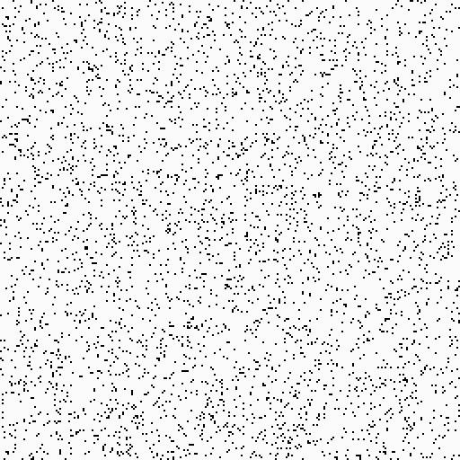

# Simulating evolution

Inspired by this video from [@davidrandallmiller](https://www.youtube.com/@davidrandallmiller):

I've decided to write that program in Rust, and maybe use OpenCL at the end.

## Roadmap

## Progress

1. Generating randomly populated field X x Y

2. Saving the field into PNG

   
